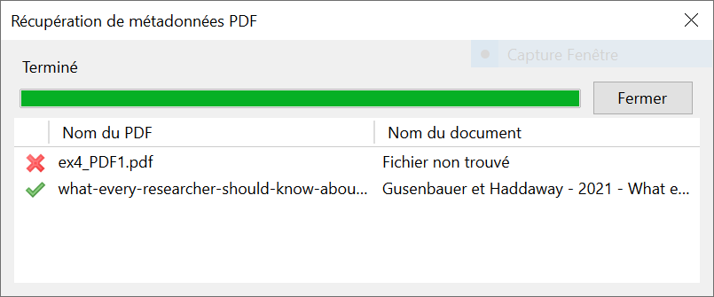
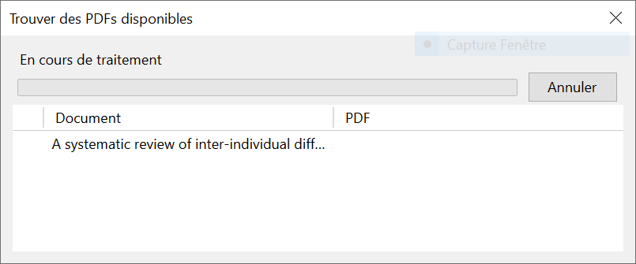

## Collecter à partir d'un PDF

Vous pouvez créer des références à partir des PDF enregistrés sur votre ordinateur. Vous pouvez récupérer les métadonnées de plusieurs PDFs en même temps. Deux conditions doivent être réunies pour que cela fonctionne:

1. Le PDF doit contenir des métadonnées exploitables.
2. Les métadonnées doivent correspondre à un document que Zotero peut trouver en ligne.

Dans le cas contraire, vous devrez entrer les métadonnées à la main.

Par ailleurs, une connexion à Internet est nécessaire pour que Zotero puisse aller chercher les informations sur le web. Si vous n'êtes pas connecté au moment de l'ajout dans Zotero, vous pouvez toujours récupérer les métadonnées plus tard (`clic-droit` sur le fichier PDF > `récupérer les métadonnées du PDF`).

À l'inverse, si vous avez enregistré une référence bibliographique à laquelle aucun PDF n'est associé, vous pouvez essayer de le récupérer directement depuis Zotero (`clic-droit` sur la référence > `Trouver un pdf disponible`).

### exercice

1. Téléchargez les PDF à partir des liens ci-dessous.
2. Glissez-les dans Zotero.
3. Observez ce qui se passe
4. Pour chaque fichier, vérifiez que la référence est complète et correcte.

[Innovating pedagogy](https://github.com/grolimur/zotero-id/blob/master/docs/innovating-pedagogy-2016.pdf) (CC BY 3.0)   
[Invisible science](https://github.com/grolimur/zotero-id/blob/master/docs/invisible-science.pdf) (CC BY 4.0)   
[What every researcher should know about searching](https://github.com/grolimur/zotero-id/blob/master/docs/what-every-researcher-should-know-about-searching.pdf) (CC BY 4.0)   

---
*notes personnelles*
