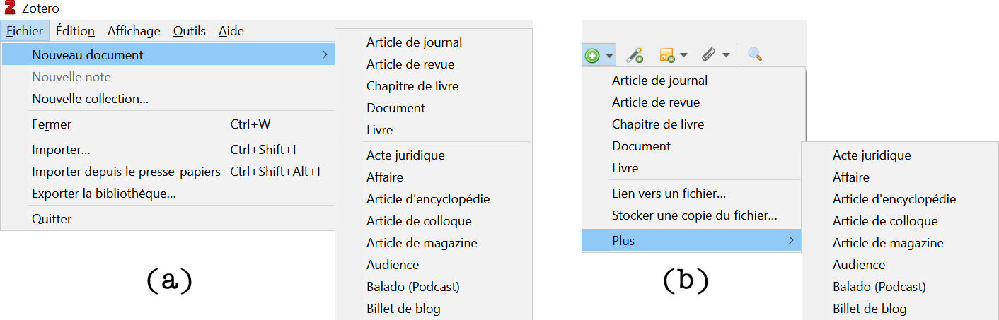

## Insérer manuellement

Parfois, il n’existe pas de métadonnées encodées dans la page que vous visitez, ou le document que vous avez entre les mains n’est pas indexé dans un catalogue électronique. Vous devrez alors créer la référence vous-même.

Exemple : un rapport de  l'[Office fédéral de la statistique](https://www.bfs.admin.ch/bfs/en/home/statistics/catalogues-databases/publications.assetdetail.3862240.html)

Vous pouvez toujours créer une entrée en cliquant sur `Fichier` > `Nouveau document` (a) ou sur le petit cercle vert avec un + (b). Sélectionnez le type de document que vous souhaitez créer une référence et une grille de description correspondante apparaît. Vous pouvez ensuite remplir les champs en fonction du document que vous avez entre les mains.   

Si vous savez pas quels champs sont nécessaires pour décrire le type de document que vous avez entre les mains, référez-vous au guide de rédaction des citations et références bibliographiques qui se trouve sur le site web de l'Infothèque (dans la section Citations et bibliographies): [https://www.hesge.ch/heg/campus/infotheque/services/guides](https://www.hesge.ch/heg/campus/infotheque/services/guides)

Soyez aussi exhaustif que possible ! Si vous avez un doute au sujet de l'utilité d'une information, entrez-la.

---

*notes personnelles*
