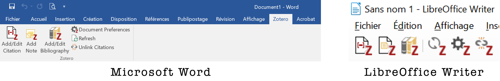

# Citer

La création d'une liste de références peut servir 2 buts différents:

1. fournir une liste de références
2. lister les références cités dans un document

Le premier cas s'appliquent par exemple aux enseignant·e·s fournissant une liste de lectures à leurs étudiant·e·s. Le deuxième cas est celui des chercheur·euse·s rédigeant un article scientifique, mais aussi celui des étudiant·e·s réalisant un travail pour lequel une revue de la littérature est nécessaire.

Ce qui distingue les 2 cas, c'est le recours ou non la citation des références dans le documents.

### exercice

**Liste de lecture**

1. Ouvrez un traitement de texte
2. Sélectionnez quelques références
3. Glissez-déposez les références depuis Zotero vers votre traitement de texte

**Références citées**

Si tout s'est bien passé lors de l'installation, Zotero est installé dans votre traitement de texte.

1. Cliquez sur le bouton "Add/Edit Citation"*
2. Dans la barre de recherche qui est apparue**, recherchez une référence de votre bibliothèque Zotero
3. Une fois sélectionnée, appuyez sur "Entrée" pour valider
4. Positionnez vous un peu plus bas dans votre document
5. Cliquez sur le bouton "Add/Edit Bibliography"
6. Retournez plus haut dans votre document et ajoutez une 2e référence
7. Cliquez sur le bouton "Document Préférences" et sélectionnez le style IEEE.

\* la première fois que vous ajoutez une référence dans le document, Zotero vous demande de choisir le style de citation. Ne vous occupez pas de cela pour le moment et cliquez sur le bouton "OK".   
\** la barre de recherche est parfois cachée derrière une autre fenêtre ouverte 

---
*notes personnelles*

