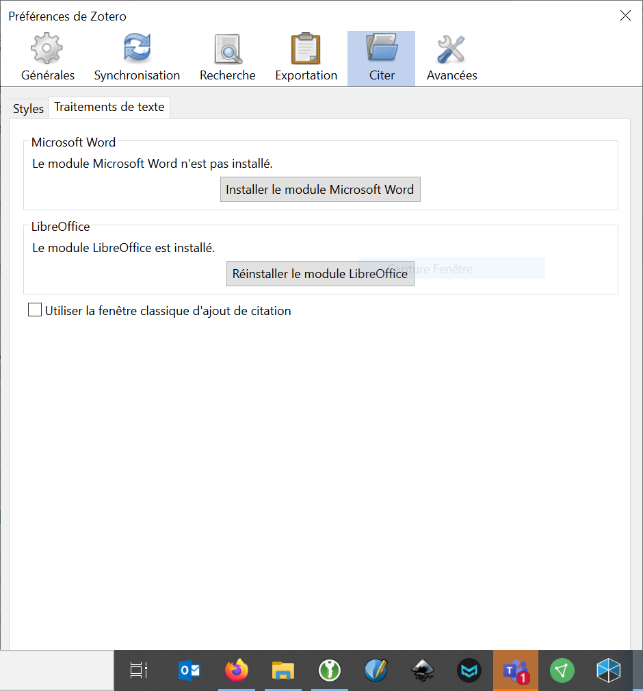

# Paramétrer

Les Préférences de Zotero permettent de paramétrer et de gérer beaucoup de choses. Pour les ouvrir, allez dans le menu `Edition` > `Preferences` (ou `Zotero` > `references` sur Mac OSX).

## Vérifier que l’installation a bien fonctionné

Pour profiter au maximum du potentiel de Zotero, le logiciel doit être connecté à votre navigateur web et à votre logiciel de traitement texte (Microsoft Word, LibreOffice Writer). 

1. Vérifiez que Zotero est installé en ouvrant l’application sur votre ordinateur
2. Ouvrez votre navigateur et vérifiez que le module Zotero apparaît dans la barre d’outil supérieure, à côté du champ de recherche.
3. Ouvrez votre traitement de texte et vérifiez que le plugin Zotero est bien installé. 

Si l’installation du bouton Zotero (complément Zotero) dans votre logiciel de traitement de texte n’a pas fonctionné, vous pouvez le réinstaller depuis les Préférences de Zotero.

1. Cliquez sur l'onglet `Citer`
2. Cliquez sur le sous-onglet `Traitements de texte`
3. À ce moment, vous pouvez choisir d’installer ou de réinstaller le complément pour votre traitement de texte.

