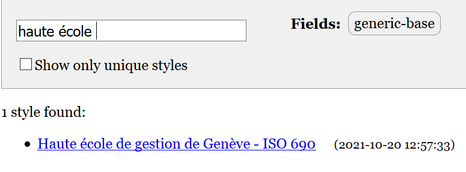

## Styles de citation

Lorsque vous avez cité, vous avez choisi un style au hasard. Au moment de l'installation, Zotero compte 15 styles couramment utilisés, mais il y en a plus de 10'000 à disposition pour répondre à vos besoins. Au cours de vos études à la HEG, vous devrez utiliser le style "Haute école de gestion de Genève - ISO 690".

### exercice

1. Dans `Préférences` > `Citer` > `Styles`, cliquez sur le lien "Obtenir d'autres styles..."
2. Cherchez le style "Haute école de gestion de Genève - ISO 690".
3. Installez-le.
4. Retournez dans votre traitement de texte.
5. Cliquez sur le bouton "Refresh"
6. Cliquez ensuite sur le bouton "Set Document Preferences"
7. Choisissez le style que vous venez d'installer

---

*notes personnelles*
