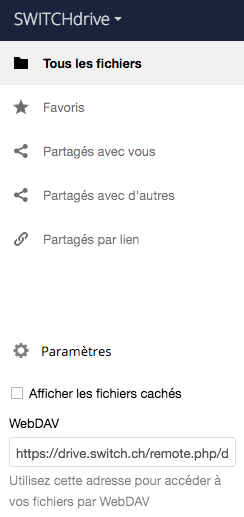

## Synchroniser

Lorsque vous avez cité, vous avez choisi un style au hasard. Au cours de vos études à la HEG, vous devrez utiliser le style "Haute école de gestion de Genève - ISO 690".

Synchroniser sa bibliothèque Zotero a 2 utilités disctinctes:

1. avoir sa bibliothèque à jour sur plusieurs périphériques (p.ex. au travail et à la maison)
2. partager des références à l'aide des groupes Zotero

Pour cela, il est nécessaire de créer un compte sur [https://zotero.org](https://zotero.org).

Comme le stockage en ligne gratuit est limité à 300 Mo, vous avez 2 options pour ne pas atteindre cette limite.

1. Décocher la case "Synchroniser le texte intégral des pièces jointes indexées"
2. Synchroniser les pièces jointes à l'aide d'un hébergeur prenant en charge le protocle WebDAV plutôt qu'avec les serveurs de Zotero.

SWITCHdrive prend en charge le protocole WebDAV et offre 100 Go de stockage gratuit à chaque membre de la communauté académique dont l'institution est partenaire de SWITCH ([https://cloud-id.switch.ch/organizations](https://cloud-id.switch.ch/organizations)). En synchronisant les pièces jointes (PDF, captures, etc.) ainsi, vous ne synchronisez plus que les références avec les serveurs de Zotero. Ces données étant textuelles, elles ne pèsent pas bien lourd (ordre de grandeur: 60 Mo pour 2'600+ références).

Notez que seules les pièces jointes de la bibliothèque personnelle peuvent être synchornisées ainsi. Les pièces jointes de groupe passent forcément par les serveurs de Zotero. 

Pour configurer la synchronisation des fichiers avec SWITCHdrive, vous avez besoin de le lien WebDAV.

1. Rendez-vous sur [https://drive.switch.ch](https://drive.switch.ch).
2. Connectez-vous avec votre identifiant SWITCH edu-ID.
3. Cliquez sur "Paramètres" en bas à gauche de l'interface
4. Copiez le lien affiché sous WebDAV

Dans Zotero:

1. Cochez Synchronisez les fichiers joints de Ma bibliothèque en utilisant...
2. Sélectionnez "WebDAV" dans le menu déroulant
3. Collez le lien que vous avet copié dans SWITCHdrive précédemment
4. Entrez vos identifiants SWITCH edu-ID
5. Cliquez sur "Tester la connexion au serveur"

Si vous avez tout configuré correctement, un message vous confirme que la synchronisation est configurée.
Dans le cas contraire, revérifiez les paramètres que vous avez entré.

---
*notes personnelles*

