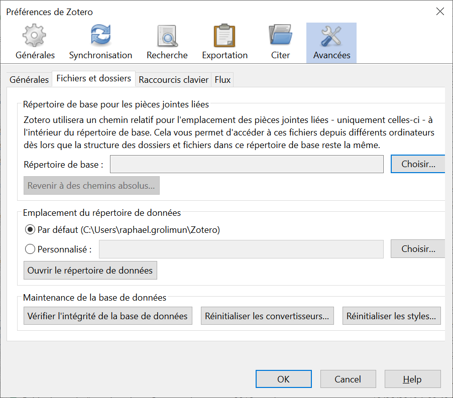

## Localiser les données de Zotero

La synchronisation des données ne doit pas être considérée comme un moyen de faire des *backups*, même si les données se trouvent effectivement sur plusieurs appareils.

Si vous voulez faire des sauvegardes de vos données Zotero, il y a un dossier qui se trouve sur votre ordinateur à sauver absolument. Pour l'atteindre, allez dans `Préférences` > `Avancées` > `Fichiers et dossiers` > bouton `Ouvrir le répertoire de données`. Vous vous retrouvez dans le dossier Zotero regroupant toutes données et paramètres de Zotero. C'est  partir de ce dossier de que vous pouvez reconstruire votre bibliothèque sur un nouvel ordinateur si le vôtre vient à vous lâcher.

---

*notes personnelles*
