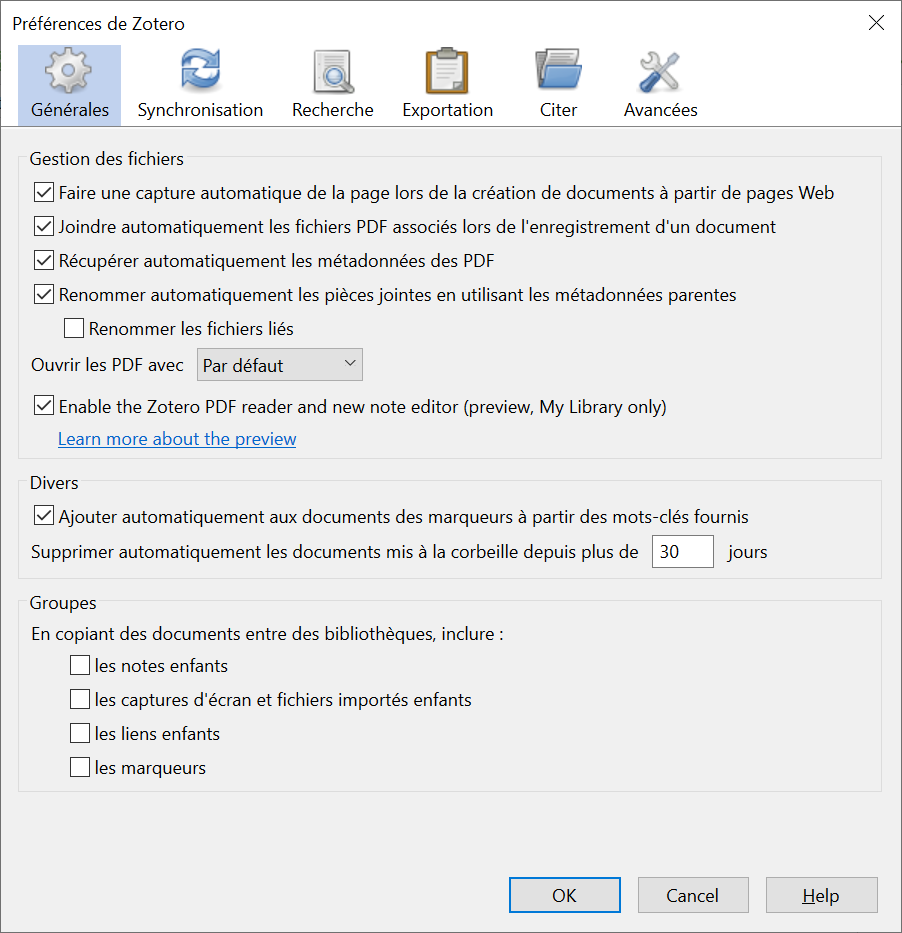

## Paramètres généraux

Parmi les paramètres généraux, je vous conseille la configuration représentée par l'illustration  ic-dessous. (Vous êtes bien sûr libre de faire d'autres choix.)

Notez que la lecture de fichier PDF directement dans Zotero sera disponible dans la version 6. Vous pouvez toutefois déjà la tester en installant la version beta de Zotero: [https://www.zotero.org/support/dev_builds](https://www.zotero.org/support/dev_builds)

---

*notes personnelles*
