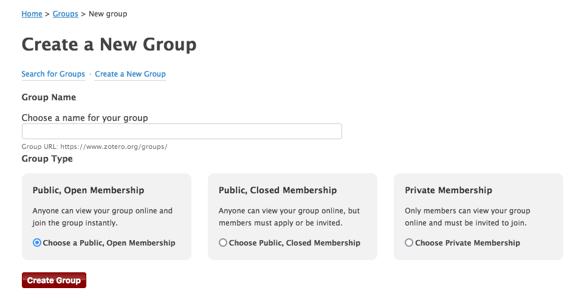

# Collaborer

Un des intérêts de Zotero est de pouvoir travailler en groupe très facilement. Pour cela, vous devez créer un compte sur [https://www.zotero.org](https://www.zotero.org).

Les groupes sont des bibliothèques séparées de votre bibliothèque personnelle. Vous passer des références de l'une à l'autre d'un simple glisser-déposer. Vous pouvez aussi directement sauvegarder une référence dans la bibliothèque de groupe sans passer par votre bibliothèque personnelle, simplement en la sélectionnant comme vous le feriez pour une (sous-)collection.

Il existe 3 types de groupes:

* public ouvert (bibliothèque accessible en ligne, adhésion libre au groupe)
* public fermé (bibliothèque accessible en ligne, adhésion au groupe soumise à validation)
* privé (bibliothèque accessible uniquement aux membres, adhésion au groupe soumise à validation)

Dans un groupe, vous pouvez tenir un des 3 rôles suivants:

* propriétaire (a tous les droits **y compris** celui de supprimer le groupe)
* administrateur·trice (a tous les droits **sauf** celui de supprimer le groupe)
* membre (a le droit de consulter la bibliothèque, peut se voir attribuer le droit d'y contribuer)

L'espace de stockage du groupe sur les serveurs de Zotero est comptabilisé sur le compte personnel du propriétaire.   
Lorsqu'un nouveau membre est admis dans un groupe, il a par défaut le rôle de membre.

---
*notes personnelles*
