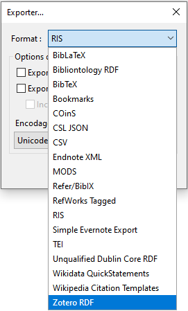

# Partager

Pour partager des références, vous pouvez exporter une sélection de références en faisant `clic-droit` sur une collection ou sélection de références > `Exporter les documents...` ou la totalité de votre bibliothèque personnelle en allant dans `Fichier` > `Exporter la bibliothèque...`.

Vous devez ensuite choisir parmi un grand nombre de formats. Comme vu pour l'import de références, 3 formats sont majoritairement utilisés: RIS, BibTeX et, entre utilisateur·trice·s de Zotero, Zotero RDF.

Bien que le contenu des fichiers RIS et BibTeX soient lisibles par un humain, ces formats d'échange sont destinés à être lus par un ordinateur.

Ils sont très pratiques pour échanges des références avec d'autres personnes, mais ils peuvent aussi servir à migrer d'un logiciel à un autre.

### exercice

1. Exportez **une collection et sa/ses sous-collection/s** au format Zotero RDF.

2. Nommez le fichier selon le schéma `nom_prenom.rdf`

3. Exportez **quelques références d'une collection** au format BibTeX.

4. Nommez le fichier selon le schéma `nom_prenom.bib`

5. Exportez **toute votre bibliothèque **au format RIS

6. Nommez le fichier selon le schéma `nom_prenom.ris`

7. Déposez les 3 fichiers sur SWITCHdrive: https://cest.la/zid

8. Ouvrez ensuite les 3 fichiers avec un éditeur de texte pour comparer leur contenu.

---

*notes personnelles*
