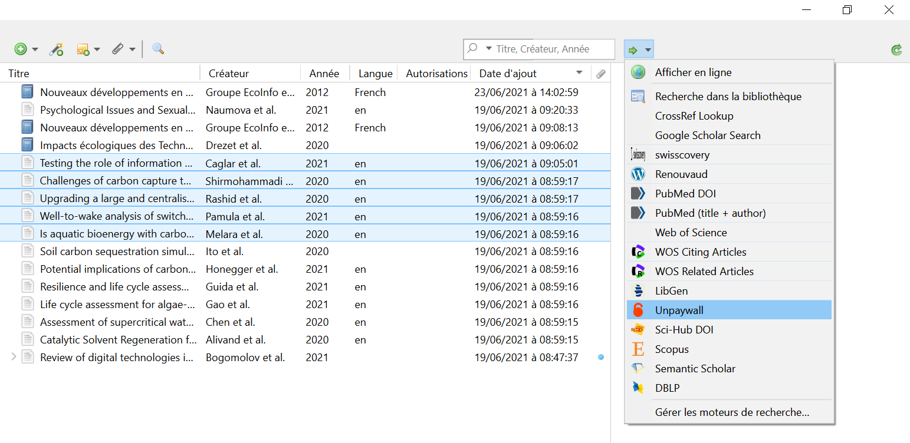
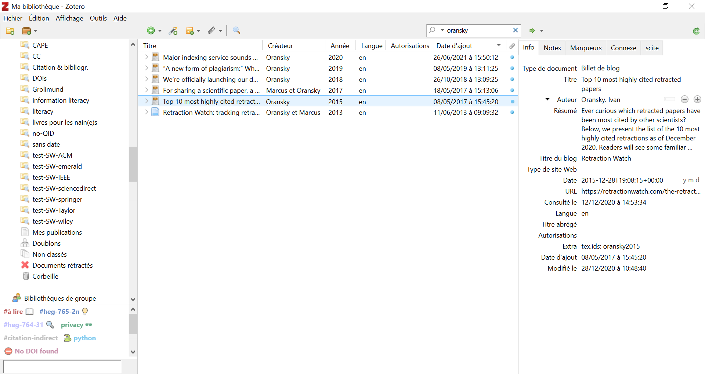

# Aller plus loin

Zotero peut faire bien plus que ce qui a été vu jusque-là. Non seulement parce qu'il est modulaire, mais aussi car il renferme des fonctionnalités peu connues et pourtant très utiles. En voici quelques-unes.

## Memento

Les contenus en ligne ayant une espérance de vie limitée, conserver la référence des lectures que vous avez faites, c'est bien, mais que ferez-vous le contenu a disparu lorsque vous voulez le citer dans un de vos travaux ? (Jones, Klein, Van de Sompel 2021) Bien que Zotero sauvegarde une capture d'écran de la page au moment de l'enregistrement, le lien vers la page originale, lui, est cassé.

C'est là que Zotero Memento entre en jeu. Une fois [installé](https://github.com/leonkt/zotero-memento), ce module fait une sauvegarde sur [Internet Archive](https://archive.org) de l'url que vous enregistrez dans Zotero. L'url archivée est ensuite renseignée dans le champ Extra de la référence concernée. 

Robust Links ([https://github.com/iipc/robustlinks](https://github.com/iipc/robustlinks)) fait de même, mais différemment.

## Moteurs de recherche internes

Zotero vous indique d'où proviennent les métadonnées dans le champ Catalogue de bibl. cela vous permet de retourner sur la plateforme pour retrouver la référence. Mais cel devient vite fastidieux si vous voulez retourner vers plusieurs références. Par ailleurs, si vous voulez trouver le texte intégral d'un article récupéré depuis une plateforme où il n'y avait pas le PDF, cela ne vous sera pas d'une grande aide. C'est là que les moteurs de recherche interns à Zotero sont très utiles.

Pour en savoir plus, lisez le billet de sur "les moteurs de recherche intégrés à Zotero" sur le blog Zotero francophone (Flamerie, Grolimund 2020). Si vous voulez ajouter des moteurs à Zotero, suivez la marche à suivre suivante:

1. Téléchargez le fichier `engine.json` mis à  votre disposition dans le matériel de cours: [https://cest.la/enjson](https://cest.la/enjson)

2. Allez dans les `Préférences` > `Avancées` > `Fichiers et dossiers` > bouton `Ouvrir le répertoire de données` 

3. Ouvrez le dossier locate

4. Remplacez le fichier `engine.json` par celui que vous venez de télécharger

5. Relancer Zotero

## Signalement des articles rétractés

Il arrive qu'un article soit retiré après sa publication, car il contient des erreurs ou un problème pouvant aller jusqu'à la une fraude scientifique (plagiat, données inventées, etc.). ON dit que l'article est "retracté". C'est un problème important pour les chercheur·euse·s qui citent un tel article. Pour des raisons (multiples) trop longues à expliquer ici, il arrive qu'un article soit plus cité après qu'une fraude y ait été détecté qu'avant ! (Oransky 2015)

Pour prévenir cela, Zotero (en partenariat avec [Retraction Watch](https://retractionwatch.com)) intègre un mécanisme de vérification signalant à l'utilisateur·trice si l'article qui vient d'être ajouté dans Zotero a été retracté.

Zotero ajoute une collection Documents rétractés dans laquelle sont automatiquement regroupés tous les articles signalés, insère une croix rouge devant la référence dans le panneau du milieu et affiche un grand bandeau rouge en en-tête des métadonnées sur la droite, minimisant les risques que l'utilisateur·trice ne le voit pas et cite l'article incriminé.

Voici quelques DOI pour tester:

10.1158/1078-0432.CCR-09-1939](https://doi.org/10.1158/1078-0432.CCR-09-1939)

10.1001/jama.299.13.1574

10.1016/j.cmet.2011.09.008

### Styles de citation

Si les 10'000 styles de citation disponibles pour Zotero ne vous conviennent pas, vous pouvez en créer un vous-même (pour un aperçu de la façon dont on s'y prend, lisez p.ex. Mellifluo, Hardegger, Grolimund 2011). [**Rappel**: pour vos études, vous n'avez pas le choix. Vous devez utiliser le style "Haute école de gestion de Genève - ISO 690".]

Les styles utilisés par Zotero sont basés sur des fichiers CSL (*Citation Style Language*). Beaucoup d'autres logiciels de gestion de références bibliographiques (dont Mendeley) utilisent aussi les fichiers CSL.

Le CSL est un langage de baslisage basé sur XML permettant de définir la façon dont les informations contenues dans Zotero doivent être affichées lorsque vous citez dans le texte) et que vous insérez une bibliographie (à la fin du document).

Toute la documentation CSL est sur [https://citationstyles.org](https://citationstyles.org).

## Modules

Les modules pour Zotero sont nombreux. Ils ajoutent une fonction qui n'existe pas nativement dans Zotero. La plupart d'entre eux sont listés sur [https://www.zotero.org/support/plugins](https://www.zotero.org/support/plugins).

L'installation d'un module se fait en général de la manière suivante:

1. Rendez-vous sur la page Github du projet et allez dans la section Releases ()sur à droite)
2. Téléchargez le plugin en faisant un `clic-droit` sur le fichier `.xpi` 
3. Ouvrez Zotero
4. Allez dans `Outils` > `Extensions`
5. Cliquez sur la petite roue crantée en haut à droite et sélectionnez `Install Add-on From File...`
6. Sélectionnez le fichier `.xpi` que vous venez de télécharger
7. Redémarrez Zotero

Le plugin devrait être installé. Aidez-vous de la documentation pour démarrer.
